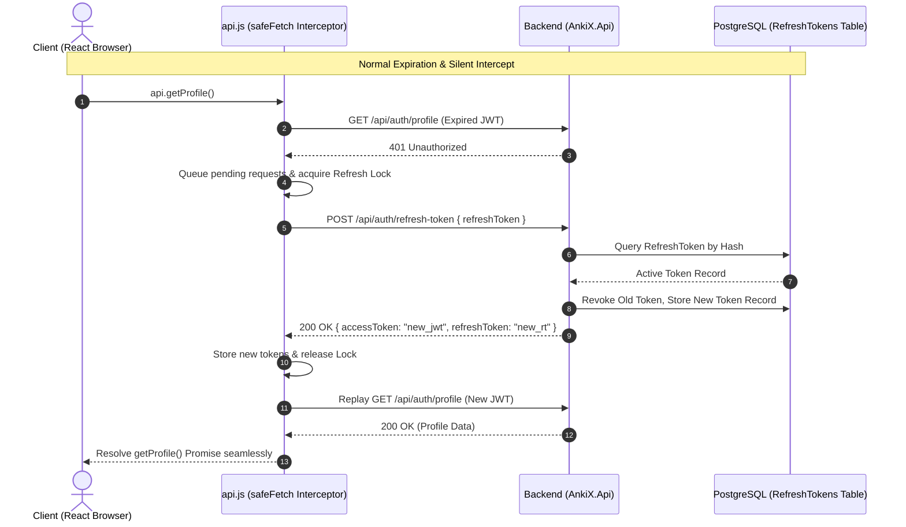

# Story 5.6: Persistent Active Session Resiliency & Silent Refresh Engine

Status: done

<!-- Note: Validation is optional. Run validate-create-story for quality check before dev-story. -->

## Story

**As a** learner actively studying decks or an author writing rich markdown exercises,  
**I want** my authenticated session to persist reliably across long active sessions with silent token refresh and zero-disruption retry on expired tokens,  
**So that** I am never unexpectedly logged out or blocked from saving my work with a `401 Unauthorized` error in the middle of active engagement.

## Business Context & Strategic Objective

In educational and spaced-repetition platforms like AnkiX, user sessions often involve extended periods of deep focus (drafting code exercises, solving complex micro-coding challenges, or reviewing large study queues). A rigid access-token timeout leads to session drop-offs, discarded drafting states, and frustrating auth barriers. 

By introducing an enterprise-grade Refresh Token Rotation (RTR) engine paired with an intelligent client-side 401 retry interceptor and in-place re-auth fallback, AnkiX eliminates auth friction while maintaining strict security boundaries (sliding expiration, single-use token rotation, revocation on logout/theft detection).

---

## Acceptance Criteria

1. **Database Schema & Refresh Token Entity Model (`RefreshToken`):**
   - Implements a dedicated `RefreshToken` entity in `src/backend/AnkiX.Api/Models/RefreshToken.cs` and `ApplicationDbContext`:
     - `Id` (int / primary key)
     - `UserId` (int, indexed, foreign key to `User`)
     - `TokenHash` (string, max 128 / SHA-256 hash of the random token string)
     - `ExpiresAt` (DateTime UTC, indexed)
     - `CreatedAt` (DateTime UTC)
     - `RevokedAt` (DateTime UTC, nullable)
     - `ReplacedByTokenHash` (string, nullable, tracks token lineage for rotation detection)
     - `CreatedByIp` (string, max 45, nullable)
   - Indexed for high-throughput lookup by `(UserId, TokenHash)` and `ExpiresAt`.

2. **Backend Silent Token Refresh Engine (`POST /api/auth/refresh-token`):**
   - Issues a cryptographically secure, high-entropy 64-character refresh token during:
     - Standard login (`POST /api/auth/login`)
     - OAuth login (`POST /api/auth/oauth`)
     - Refresh token exchange (`POST /api/auth/refresh-token`)
   - `AuthResponse` contract updated to include `refreshToken`:
     ```json
     {
       "accessToken": "eyJhbGciOi...",
       "refreshToken": "7f8b9c...",
       "expiresInSeconds": 3600,
       "user": { ... }
     }
     ```
   - Implements `POST /api/auth/refresh-token`:
     - Accepts payload `{ "refreshToken": string }`.
     - Validates token exists, is active (`RevokedAt == null`), and is not expired (`ExpiresAt > DateTime.UtcNow`).
     - **Token Rotation (RTR):** Automatically marks the old refresh token as revoked (`RevokedAt = DateTime.UtcNow`, `ReplacedByTokenHash = newHash`), generates a fresh refresh token, and returns a new JWT access token + new refresh token.
     - **Compromise Detection:** If a revoked refresh token is presented for refresh, invalidates all active refresh tokens in that user's lineage/family to prevent replay attacks.
     - Returns `200 OK` with updated `AuthResponse`. Returns `401 Unauthorized` with clear error message if invalid, revoked, or expired.
   - Implements `POST /api/auth/revoke-token`:
     - Allows revoking specific refresh tokens upon explicit logout (`POST /api/auth/revoke-token`).

3. **Frontend Token Management & Storage Layer (`src/frontend/src/api.js`):**
   - Stores `ankix_refresh_token` in `localStorage` alongside `ankix_token` and `ankix_user`.
   - Modifies `getToken()` to prevent premature aggressive logout when the access token is momentarily expired.
   - Cleans up `ankix_refresh_token` upon full explicit logout.

4. **Transparent 401 Client Interceptor & Concurrency Queue (`safeFetch`):**
   - Enhances `safeFetch` in `src/frontend/src/api.js`:
     - When an authenticated request fails with HTTP `401 Unauthorized`:
       - Checks if a refresh token is present.
       - If present, initiates or attaches to a singleton in-flight token refresh promise (preventing race conditions / thundering herds when multiple concurrent requests 401 simultaneously).
       - Once refreshed, updates stored tokens and transparently replays the original failed request with the new `Authorization: Bearer <new_token>` header.
       - Returns the replayed response to the original caller with zero code changes required across application components.
     - If the refresh token request itself fails with `401` or `400` (e.g. expired or revoked session):
       - Clears stale tokens.
       - Dispatches an auth state invalidation event or opens the in-place contextual re-auth modal without wiping active form state.

5. **Contextual In-Place Re-Authentication & Work Preservation:**
   - If a session is genuinely expired or revoked beyond refresh limits while the user is actively drafting content or submitting actions:
     - Dispatches a non-destructive contextual re-authentication prompt (`ReAuthModal` / `AuthModal`).
     - Allows logging in with existing credentials or OAuth in-place without page reload or navigating away, preserving form inputs.
     - Automatically completes/retries the pending submission once authentication succeeds.

6. **Comprehensive Automated Test Coverage:**
   - Backend unit tests (`src/backend/AnkiX.Api.Tests/RefreshTokenTests.cs`):
     - Successful login returns refresh token.
     - Successful refresh rotates token and returns new JWT access token.
     - Expired refresh token returns `401 Unauthorized`.
     - Revoked refresh token returns `401 Unauthorized`.
     - Explicit token revocation succeeds.
   - Frontend unit tests (`src/frontend/src/__tests__/api-refresh.test.js` or `api.test.jsx`):
     - `safeFetch` intercepts 401, invokes refresh endpoint, and replays pending request.
     - Concurrent 401s deduplicate onto a single refresh call.
     - Failed refresh clears tokens and triggers re-auth callback.

---

## Tasks / Subtasks

- [x] Task 1: Backend Refresh Token Data Model & Migration (AC: 1)
  - [x] Create `RefreshToken.cs` in `src/backend/AnkiX.Api/Models/`.
  - [x] Add `DbSet<RefreshToken> RefreshTokens` and indexes to `ApplicationDbContext.cs`.
  - [x] Add helper methods for token hashing (SHA-256) and generation in `TokenService` or `AuthHelper`.
- [x] Task 2: Backend Refresh Token Endpoints & Auth Controller Integration (AC: 2)
  - [x] Update `AuthResponse.cs` to include `string RefreshToken`.
  - [x] Create `RefreshTokenRequest.cs` and `RevokeTokenRequest.cs` in `src/backend/AnkiX.Api/Contracts/Auth/`.
  - [x] Update `Login` and `OAuth` endpoints in `AuthController.cs` to issue and persist refresh tokens.
  - [x] Implement `POST /api/auth/refresh-token` with Token Rotation and reuse detection.
  - [x] Implement `POST /api/auth/revoke-token` to support clean logout token invalidation.
- [x] Task 3: Backend Automated Tests (AC: 6)
  - [x] Create `RefreshTokenTests.cs` in `src/backend/AnkiX.Api.Tests/`.
  - [x] Verify rotation, expiration, and invalidation test cases.
- [x] Task 4: Frontend API Layer Interceptor & Concurrency Queue (AC: 3, 4)
  - [x] Update `login`, `oauthLogin`, and `logout` in `src/frontend/src/api.js` to manage `ankix_refresh_token`.
  - [x] Implement `refreshToken()` API function in `src/frontend/src/api.js`.
  - [x] Refactor `safeFetch` to implement a mutex-locked 401 retry interceptor with request queuing.
  - [x] Update `getToken()` to avoid premature destructive logout.
- [x] Task 5: Contextual Re-Auth UI & State Preservation (AC: 5)
  - [x] Create/update re-auth event emitter / callback hook in `api.js` and `AuthProvider.jsx`.
  - [x] Ensure non-destructive in-place re-auth dialog is presented when session is completely invalid.
- [x] Task 6: Frontend Automated Tests & Verification (AC: 6)
  - [x] Create unit tests in `src/frontend/src/__tests__/api-refresh.test.jsx`.
  - [x] Run full test suites (`dotnet test` - 138 passing, `npm run test:ci` - 13 suites, 46 tests passing).
  - [x] Update `sprint-status.yaml` to `review`.

### Review Findings
- [x] [Review][Patch] Generate EF Core database migration for `RefreshTokens` table [`src/backend/AnkiX.Api/Migrations/`]
- [x] [Review][Patch] Add 30-second token rotation grace window to prevent false-positive reuse detection lockouts on multi-tab/parallel refreshes [`src/backend/AnkiX.Api/Controllers/AuthController.cs:271`]
- [x] [Review][Patch] Modify `authHeaders()` to avoid throwing synchronously when refresh token is available, enabling `safeFetch` silent refresh [`src/frontend/src/api.js:464`]
- [x] [Review][Patch] Revoke all active refresh tokens for the user upon password reset [`src/backend/AnkiX.Api/Controllers/AuthController.cs:441`]
- [x] [Review][Patch] Sanitize 500 error messages in `AuthController` to prevent internal database error disclosure [`src/backend/AnkiX.Api/Controllers/AuthController.cs:338`]
- [x] [Review][Patch] Add case-insensitive header normalization and URL safety check in `safeFetch` [`src/frontend/src/api.js:81`]
- [x] [Review][Patch] Configure unique constraint index on `RefreshToken.TokenHash` [`src/backend/AnkiX.Api/Data/ApplicationDbContext.cs:93`]
- [x] [Review][Patch] Handle `ReAuthModal` dismissal by invoking logout to prevent ghost authenticated state [`src/frontend/src/auth/AuthProvider.jsx:86`]
- [x] [Review][Defer] Implement background hosted service to prune expired/revoked refresh tokens — deferred, maintenance task
- [x] [Review][Defer] Evaluate HttpOnly cookie storage migration for refresh tokens in future architecture review — deferred, architectural enhancement

---

## Technical Specifications & Architecture Design

### Refresh Token Lifecycle Flow


### Security & Token Rotation Mechanics
1. **Cryptographic Generation:** 32 bytes of secure random data (`RandomNumberGenerator.GetBytes(32)`) formatted as a hex string.
2. **Storage Integrity:** The database stores `SHA256(refreshToken)` (`TokenHash`) so that a database read leak cannot be used to forge session refreshes.
3. **Lineage Tracking & Single-Use:** Every refresh immediately sets `RevokedAt = DateTime.UtcNow` and `ReplacedByTokenHash = newHash`. If an already-revoked token hash is submitted, the system flags token theft and revokes all active child and sibling tokens for that user.
4. **Sliding Expiration:** Refresh tokens have a default lifetime of 30 days (`DateTime.UtcNow.AddDays(30)`).

---

## Dev Agent Record

### Implementation Notes
- **Backend (`AnkiX.Api`):**
  - Added `RefreshToken` entity model with SHA-256 hash storage and index coverage on `(UserId, TokenHash)`, `TokenHash`, and `ExpiresAt`.
  - Added `RefreshTokenExpiresInDays` (default 30) to `JwtOptions`.
  - Implemented `GenerateRefreshToken()`, `HashToken()`, and `GetRefreshTokenExpiresInDays()` in `TokenService`.
  - Updated `AuthResponse` to include `RefreshToken`.
  - Added `RefreshTokenRequest` and `RevokeTokenRequest` DTO contracts.
  - Updated `Login` and `OAuth` in `AuthController` to issue and persist refresh tokens.
  - Implemented `POST /api/auth/refresh-token` with strict token rotation (RTR) and reuse compromise detection (invalidates all user sessions if a revoked token is re-submitted).
  - Implemented `POST /api/auth/revoke-token` for graceful revocation during user logout.
  - Added 7 comprehensive unit test assertions in `RefreshTokenTests.cs` (all 138 backend tests passing).
- **Frontend (`ankix-web`):**
  - Updated `safeFetch` in `api.js` to automatically intercept 401 responses for authenticated API calls, queue concurrent requests behind a singleton refresh promise, and transparently retry the original request with the freshly minted bearer token.
  - Prevented premature logout in `getToken()` so expired tokens can be refreshed seamlessly by `safeFetch`.
  - Updated `login` and `oauthLogin` to persist `ankix_refresh_token` in `localStorage`.
  - Updated `logout` to send background token revocation and clean up `ankix_refresh_token`.
  - Converted all frontend API functions to use `safeFetch`.
  - Built `ReAuthModal` component and wired `onAuthFailure` listener in `AuthProvider` to prevent loss of in-flight form data when sessions are permanently expired.
  - Added frontend test suite `api-refresh.test.jsx` testing interceptor, rotation, deduplication, and auth failure (all 46 tests passing across 13 test suites).

## File List
- `src/backend/AnkiX.Api/Models/RefreshToken.cs` (New)
- `src/backend/AnkiX.Api/Data/ApplicationDbContext.cs` (Modified)
- `src/backend/AnkiX.Api/Options/JwtOptions.cs` (Modified)
- `src/backend/AnkiX.Api/Services/ITokenService.cs` (Modified)
- `src/backend/AnkiX.Api/Services/TokenService.cs` (Modified)
- `src/backend/AnkiX.Api/Contracts/Auth/AuthResponse.cs` (Modified)
- `src/backend/AnkiX.Api/Contracts/Auth/RefreshTokenRequest.cs` (New)
- `src/backend/AnkiX.Api/Contracts/Auth/RevokeTokenRequest.cs` (New)
- `src/backend/AnkiX.Api/Controllers/AuthController.cs` (Modified)
- `src/backend/AnkiX.Api.Tests/RefreshTokenTests.cs` (New)
- `src/frontend/src/api.js` (Modified)
- `src/frontend/src/components/ReAuthModal.jsx` (New)
- `src/frontend/src/auth/AuthProvider.jsx` (Modified)
- `src/frontend/src/__tests__/api-refresh.test.jsx` (New)
- `_bmad-output/implementation-artifacts/5-6-persistent-active-session-resiliency-and-silent-jwt-refresh-engine.md` (Modified)
- `_bmad-output/implementation-artifacts/sprint-status.yaml` (Modified)

## Change Log
- 2026-08-24: Implemented Story 5.6 full-stack refresh token rotation, safeFetch 401 retry interceptor, in-place re-auth modal, and automated test coverage.
