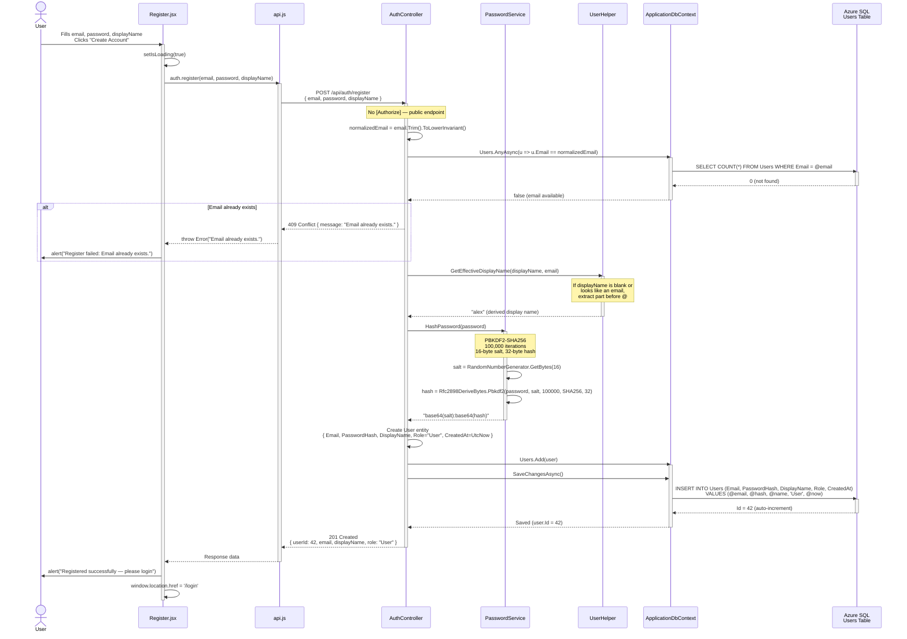
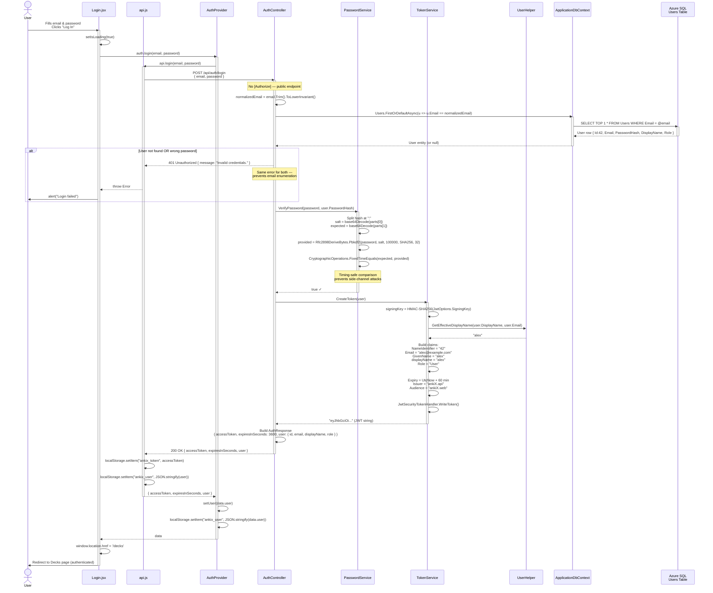
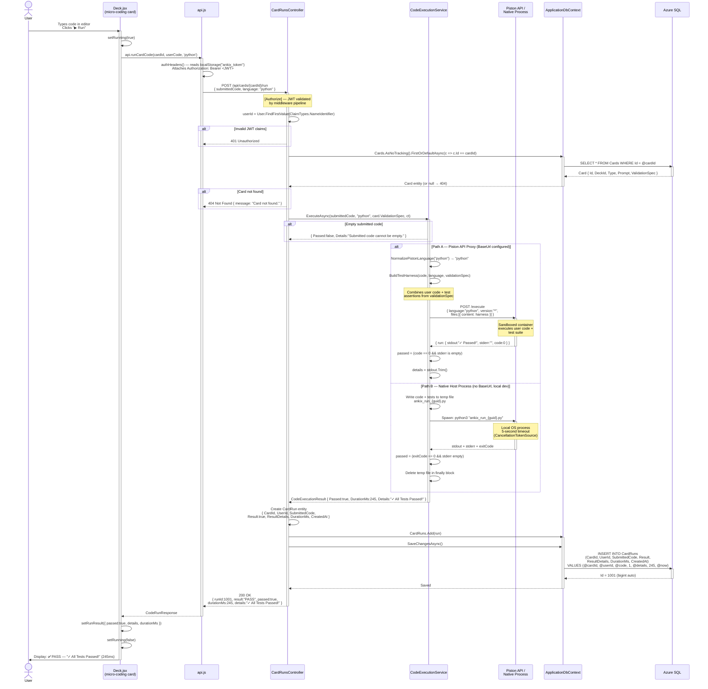
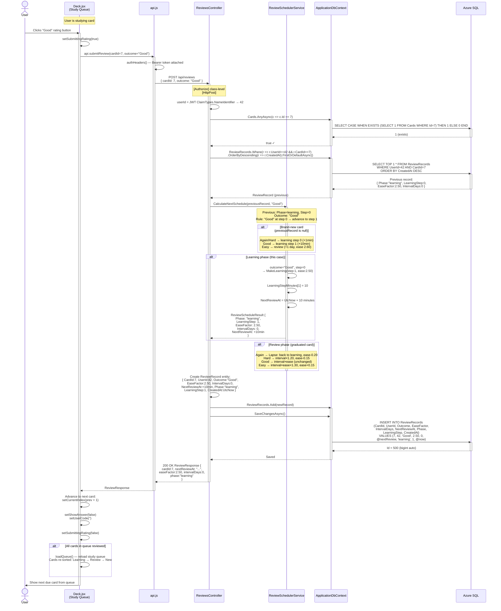
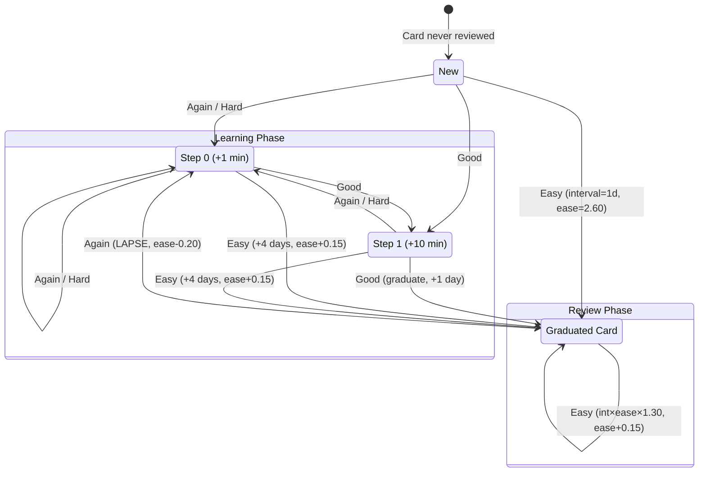
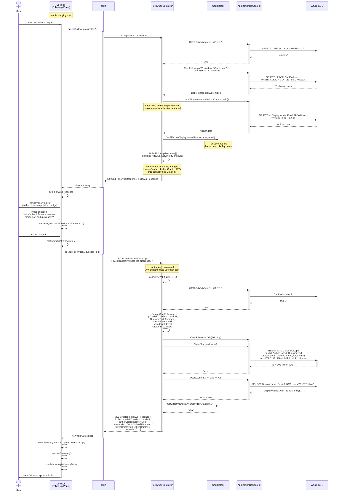
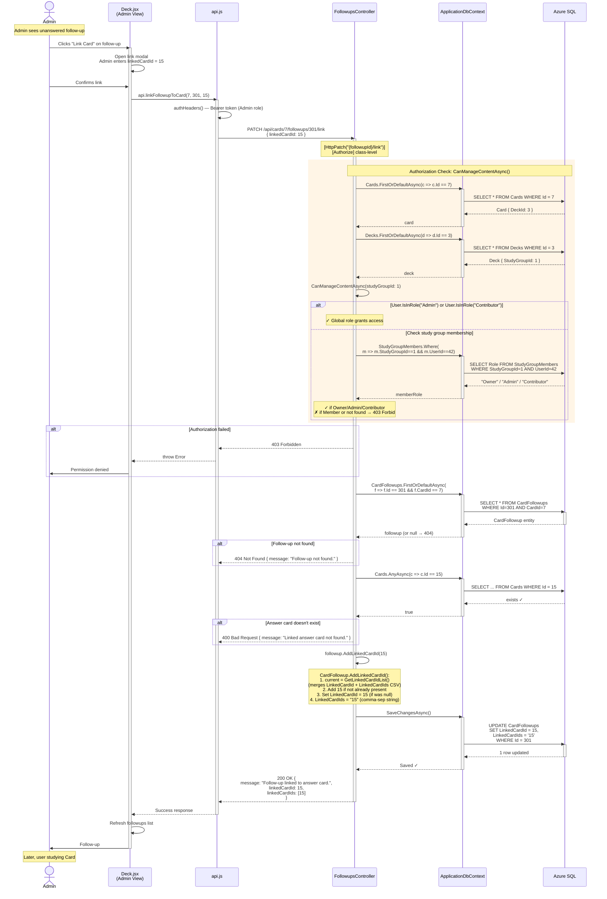
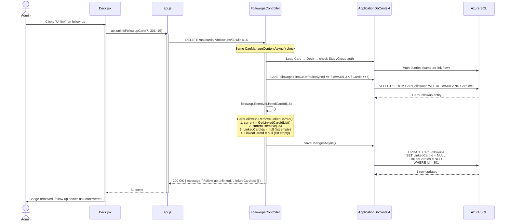

# AnkiX — Architecture Sequence Diagrams

> Visual execution traces for the 4 most critical workflows in the AnkiX platform.
> Each diagram follows the request from the user's browser through every architectural
> layer: React Component → api.js → ASP.NET Controller → Service → EF Core → Azure SQL.
>
> **Companion document**: [FEATURE_EXECUTION_TRACES.md](./FEATURE_EXECUTION_TRACES.md)

---

## Table of Contents

1. [Authentication Flow](#1-authentication-flow)
2. [Code Execution Flow](#2-code-execution-flow)
3. [SM-2 Spaced Repetition Review Flow](#3-sm-2-spaced-repetition-review-flow)
4. [Card Follow-up & Admin Linking Flow](#4-card-follow-up--admin-linking-flow)

---

## 1. Authentication Flow

### 1a. User Registration

### 1b. User Login & JWT Generation

---

## 2. Code Execution Flow

---

## 3. SM-2 Spaced Repetition Review Flow

### SM-2 Algorithm State Machine

---

## 4. Card Follow-up & Admin Linking Flow

### 4a. Adding a Follow-up Question (Any Authenticated User)

### 4b. Admin/Contributor Linking an Answer Card to a Follow-up

### 4c. Unlinking a Card from a Follow-up

---

> **End of Architecture Sequence Diagrams** — These 4 workflows trace every HTTP request
> from the user's browser through the full React → api.js → ASP.NET → EF Core → SQL stack,
> including all authorization checks, error branches, and database mutations.
